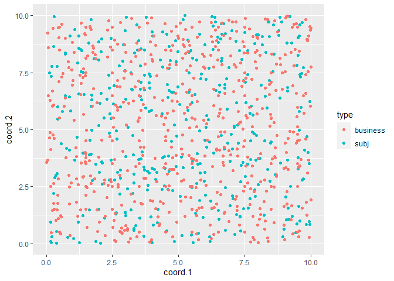
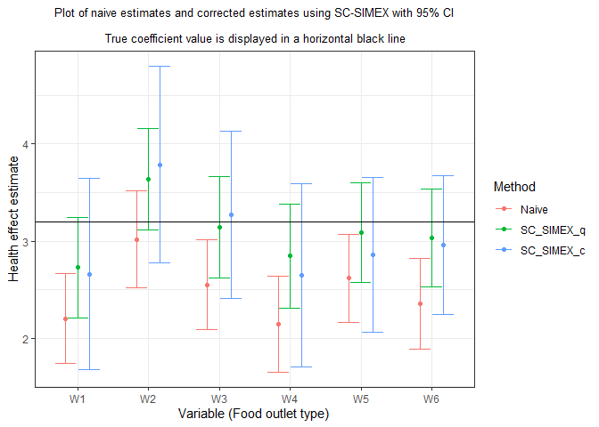

Supplementary R code for SC-SIMEX
================

This R code (R version 4.0.5) with simulated subject and business data
demonstrates an example of bias correction using [SC-SIMEX](http://doi.org/10.1002/sim.9338). Plots and
output below are reproducible with provided codes and data. For this toy example,
400 subjects and 600 businesses are generated
uniformly on the 10 x 10 grid and the buffer radius is set to be 0.3
(Euclidean distance) considering the size of zip polygon (unit square).
ZIP centroid is a centre of 1 x 1 square.

We assume initial coarsening  is 15% for all 6 food outlet types.

## Set-up for Data Generation

Subject (N=400) and businesses (J=600, Q=6) are uniformly distributed on
10 x 10 grid. True parameter values for the outcome is same as the
Section 4.

``` r
subj.data <- read.csv(file='Data/subj_data.csv', header = T)
head(subj.data)
```

    ##   id       lat      lon
    ## 1  1 3.0776611 5.112374
    ## 2  2 2.5767250 2.777107
    ## 3  3 5.5232243 3.606569
    ## 4  4 0.5638315 4.375279
    ## 5  5 4.6854928 8.030667
    ## 6  6 4.8377074 5.206097

``` r
business.data <- read.csv(file='Data/business_data.csv', header = T)
head(business.data)
```

    ##   id  true_lat true_lon ServiceType A zipcode observed_lat observed_lon
    ## 1  1 0.9942609 6.939725           1 1      61    0.9942609     6.939725
    ## 2  2 2.2993408 2.022793           1 1      23    2.2993408     2.022793
    ## 3  3 4.4362621 5.222016           1 1      55    4.4362621     5.222016
    ## 4  4 5.1570490 8.133963           1 1      86    5.1570490     8.133963
    ## 5  5 9.2489425 9.161582           1 0     100    9.5000000     9.500000
    ## 6  6 0.4445684 9.463884           1 1      91    0.4445684     9.463884

``` r
zipcode.data <- read.csv(file='Data/zipcentroid.csv', header = T)
head(zipcode.data)
```

    ##   zipcode lat lon
    ## 1       1 0.5 0.5
    ## 2       2 1.5 0.5
    ## 3       3 2.5 0.5
    ## 4       4 3.5 0.5
    ## 5       5 4.5 0.5
    ## 6       6 5.5 0.5

``` r
N <- nrow(subj.data)  # number of subj 
p <- 1                # number of subject-specific covariates
Q <- 6                # number of distinct foot outlet types

ServiceType <- business.data$ServiceType # type of outlets
efs <- table(ServiceType) # number businesses in each service type (m_q in the main paper) 
J <- sum(efs)


theta <- 0.3             # radius
beta_naught <- 20        # baseline mean
beta_one <- 2            # true parameters for subject specific covariates (length==p)
beta_two <- rep(3.2, Q)  # true parameters for exposure covariates (length==Q)
beta_true <- c(beta_naught,beta_one,beta_two)
PredictorName<-c("intercept","z", paste("x",1:Q,sep=""))


#number and ids of coarsened businesses by outlet types
init.coarsened_num <- table(business.data$A, business.data$ServiceType)[1,] 
init.coarsen_id <- business.data$id[business.data$A==0] #A=0 if coarsened
lambda.naive <- mean(init.coarsened_num/efs) # equal coarsening proportions; 
                                             #if different, we need a vector 


subj.coords <- cbind(subj.data$lat, subj.data$lon)
ef.obs.coords  <- cbind(business.data$observed_lat, business.data$observed_lon)
ef.true.coords  <- cbind(business.data$true_lat, business.data$true_lon)
zipcent.coords <- cbind(zipcode.data$lat, zipcode.data$lon)
colnames(subj.coords) <- c('lat', 'lon')
colnames(ef.obs.coords) <- c('lat', 'lon')
```

## Visualize the grid (10x10)

``` r
s = rep("subj", N); b = rep("business", J)
df = data.frame(type = c(s,b), coord=rbind(subj.coords, ef.obs.coords))
names(df) <- c('type', 'coord.1', 'coord.2')
ggplot(as.data.frame(df), aes(x =coord.1, y = coord.2, col=type)) + 
  xlim(0,10) + ylim(0,10)+  geom_point()
```

<!-- -->

## Distance matrices to compute  and 

``` r
# By business types,
# get pairwise subject-business distance matrix 
# This is a distance between subjects and businesses when businesses have true geocodes.
dist.subj.efs.truecoord <- fields::rdist(subj.coords,ef.true.coords)
dist.subj.efs.truecoord <- (dist.subj.efs.truecoord <= theta)
dist.subj.efs.truecoord.list <- lapply(as.list(1:J), 
                                function(i)which(dist.subj.efs.truecoord[,i]!=0))
rm(dist.subj.efs.truecoord)


# dist.subj.efs.zipcentcoord : distance between subjects and businesses' observed geocodes
dist.subj.efs.obscoord <- fields::rdist(subj.coords, ef.obs.coords)
dist.subj.efs.obscoord <- (dist.subj.efs.obscoord <= theta)
dist.subj.efs.obscoord.list <- lapply(as.list(1:J), 
                               function(i)which(dist.subj.efs.obscoord[,i]!=0))
rm(dist.subj.efs.obscoord)


# dist.subj.efs.zipcentcoord : distance between subjects and ZIP centroids of businesses
# This is a distance between subjects and businesses when business geocodes are coarsened.
dist.subj.efs.zipcentcoord <- fields::rdist(subj.coords, 
                                            zipcent.coords[business.data$zipcode,])
dist.subj.efs.zipcentcoord <- dist.subj.efs.zipcentcoord <= theta
dist.subj.efs.zipcentcoord.list <- lapply(as.list(1:nrow(ef.obs.coords)), 
                                   function(i)which(dist.subj.efs.zipcentcoord[,i]!=0))
rm(dist.subj.efs.zipcentcoord)


# dist.subj.zipcentcoord : distance between subjects and any ZIP centroids
# containZip: indicator of the presence of ZIP centroids in the buffer 
dist.subj.zipcentcoord <- fields::rdist(subj.coords, zipcent.coords)
dist.subj.zipcentcoord <- dist.subj.zipcentcoord <= theta
containZip <- rowSums(dist.subj.zipcentcoord) 
```

``` r
table(containZip)   # 0: no ZIP centroid in the buffer, 1: >=1 ZIP centroid in the buffer                 
```

    ## containZip
    ##   0   1 
    ## 275 125

There are 275 schools in a stratum without ZIP centroid in the buffer
whereas 125 schools in the other stratum when we use 0.3 mi for the
radius. Note that a size of the stratum with no ZIP centroid in the
buffer is generally larger than the other stratum (Web Table 1).

## True exposures and observed exposures

``` r
x.mat <- matrix(NA, N, Q)
for(q in 1:Q){
  x.mat[,q] <- tabulate(unlist(dist.subj.efs.truecoord.list[which(ServiceType==q)]), 
                        nbins = N)
}

w.mat <- matrix(NA, N, Q)
for(q in 1:Q){
  w.mat[,q] <- tabulate(unlist(dist.subj.efs.obscoord.list[which(ServiceType==q)]),
                        nbins = N)
}
```

## Generate outcome data

See Section 3.1 and Section 4 for the outcome model. We have one 
subject-specific covariate  with =0.5) (e.g., “Sex”:
Female-0,Male-1).

``` r
set.seed(15347)
z <- matrix(rbinom(N, size=1, prob = 0.5),ncol=1)  # subject-specific covariate 
sd.true <- 1                                       # standard deviation for outcome
y <- beta_naught + 
     z * beta_one + 
     x.mat %*% beta_two + rnorm(n=N, mean=0, sd=sd.true) # health outcome 

my.subj.data <- data.frame(subj.coords,
                           containZip,
                           z, 
                           x.mat, 
                           y)
names(my.subj.data)=c("lat","lon","numcent","z",paste0("x",1:Q), "y")
my.subj.data$id <- 1:N
head(my.subj.data)
```

    ##         lat      lon numcent z x1 x2 x3 x4 x5 x6        y id
    ## 1 3.0776611 5.112374       0 0  0  0  0  1  0  0 24.62393  1
    ## 2 2.5767250 2.777107       1 1  1  2  2  0  0  0 37.29627  2
    ## 3 5.5232243 3.606569       1 0  0  1  0  2  0  0 27.96235  3
    ## 4 0.5638315 4.375279       1 0  0  0  0  0  0  0 20.69781  4
    ## 5 4.6854928 8.030667       0 0  1  0  0  0  1  1 30.15877  5
    ## 6 4.8377074 5.206097       0 1  0  0  0  0  0  1 25.49345  6

``` r
#regression coefficient estimates when latent true exposures are used
coef.truereg <- lm(formula = y ~ z + x.mat  , data=my.subj.data)$coefficients
coef.truereg
```

    ## (Intercept)           z      x.mat1      x.mat2      x.mat3      x.mat4 
    ##   20.022686    2.045974    3.184608    3.346285    2.983842    3.253791 
    ##      x.mat5      x.mat6 
    ##    3.345273    3.238352

## Naive fit
We first fit the model that ignores the measurement errors in covariates. Here we 
present the regression coefficient estimates when observed exposures (Ws) are used.
``` r
naive.model <- lm(my.subj.data$y ~ my.subj.data$z + w.mat)
naive.coef.est <- coef(naive.model)
naive.coef.est 
```

    ##    (Intercept) my.subj.data$z         w.mat1         w.mat2         w.mat3 
    ##      21.251746       1.959149       2.203658       3.019011       2.550694 
    ##         w.mat4         w.mat5         w.mat6 
    ##       2.146712       2.619660       2.358137

``` r
resultnaive <- cbind(summary(naive.model)$coefficients[,c("Estimate", "Std. Error")], 
                     confint(naive.model))
```

## Run SC-SIMEX
Now we run SC-SIMEX to obtain bias-corrected coefficient estiamtes. For this example, 
we use = 15%, 
=10, and 
=50%. We use 20 repeated samples for each 
coarsening proportions and the =100 bootstrap samples to compute boostrap variances. 
``` r
#Set a grid of coarsening proportion
min.lambda <- lambda.naive; 
max.lambda <- 0.5 
S = 10            
lambda <- seq(from=min.lambda, to=max.lambda, length.out = S)


#Simulation Setting 
K = 100          # number of bootstrap samples 
B = 20           # number of repeated samples to estimate coefficients 


#Run SC-SIMEX
#wcubic: weighted cubic extrapolation function
#wquad: weighted quadratic extrapolation function
resultsimex_c <- sc_simex(my.subj.data, K, S, extrapolation = 'wcubic')
resultsimex_q <- sc_simex(my.subj.data, K, S, extrapolation = 'wquad')
```

## Corrected results

``` r
resultall <- data.frame(rbind(as.matrix(resultnaive), as.matrix(resultsimex_q), 
                              as.matrix(resultsimex_c)))
colnames(resultall) <- c("Est", "SE", "LB", "UB")
resultall$Method <- rep(c("Naive", "SC_SIMEX_q","SC_SIMEX_c"), each=length(PredictorName))
resultall$Method <- factor(resultall$Method, 
                           levels = c("Naive", "SC_SIMEX_q","SC_SIMEX_c"))
resultall$Variable<- rep(c("Int", "z", paste0("W", 1:Q)),3)
resultall <- resultall[resultall$Variable %in% paste0("W", 1:Q), ]
rownames(resultall) <- NULL  
resultall
```

    ##         Est        SE       LB       UB     Method Variable
    ## 1  2.203658 0.2366093 1.738476 2.668839      Naive       W1
    ## 2  3.019011 0.2526520 2.522289 3.515734      Naive       W2
    ## 3  2.550694 0.2364485 2.085828 3.015560      Naive       W3
    ## 4  2.146712 0.2513030 1.652642 2.640783      Naive       W4
    ## 5  2.619660 0.2307588 2.165980 3.073340      Naive       W5
    ## 6  2.358137 0.2384464 1.889343 2.826931      Naive       W6
    ## 7  2.728193 0.2642445 2.210283 3.246103 SC_SIMEX_q       W1
    ## 8  3.634620 0.2657571 3.113746 4.155494 SC_SIMEX_q       W2
    ## 9  3.142062 0.2652713 2.622140 3.661984 SC_SIMEX_q       W3
    ## 10 2.846799 0.2720156 2.313658 3.379940 SC_SIMEX_q       W4
    ## 11 3.090323 0.2612444 2.578293 3.602352 SC_SIMEX_q       W5
    ## 12 3.034348 0.2553446 2.533882 3.534814 SC_SIMEX_q       W6
    ## 13 2.661743 0.5016196 1.678586 3.644899 SC_SIMEX_c       W1
    ## 14 3.787752 0.5165210 2.775390 4.800115 SC_SIMEX_c       W2
    ## 15 3.272449 0.4378088 2.414359 4.130538 SC_SIMEX_c       W3
    ## 16 2.648890 0.4803521 1.707417 3.590363 SC_SIMEX_c       W4
    ## 17 2.857386 0.4053273 2.062959 3.651813 SC_SIMEX_c       W5
    ## 18 2.958867 0.3631030 2.247199 3.670536 SC_SIMEX_c       W6

``` r
#Display the results and compare with true coefficient values
plot <- ggplot(resultall, aes(x = Variable, y = Est, colour = Method)) + theme_bw()+
  theme(plot.title = element_text(size=10, hjust = 0.5)) + 
  geom_errorbar(aes(ymax = UB, ymin = LB), position = position_dodge(width=0.5)) + 
  geom_point(position = position_dodge(0.5)) + geom_hline(yintercept=3.2) + 
  xlab('Variable (Food outlet type)') + ylab('Health effect estimate') + 
  ggtitle("Plot of naive estimates and corrected estimates using SC-SIMEX with 95% CI
          \n True coefficient value is displayed in a horizontal black line")
plot
```

<!-- -->

Compared to the naive model (red), corrections from SC-SIMEX with
quadratic (green) and cubic (blue) extrapolants cover the true
coefficient values of all predictors within 95% confidence intervals.

For questions and bug reports, please contact jungywon@umich.edu.
